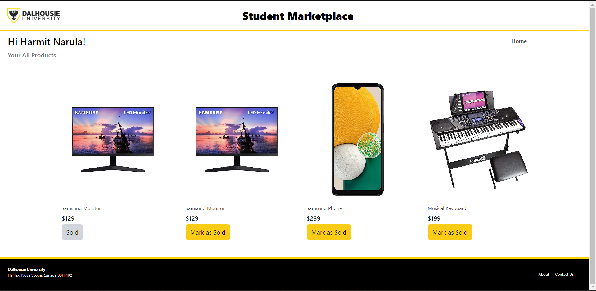

# Student Marketplace

Student Marketplace is a web application for Dalhousie University students, where a user can sell and buy items.

## Features

| Features      | Definition    |
|:------------------- |:---------- |
| Authentication | We have included a two-factor authentication for verifying first-time users. When a user signs up for the service, they are asked for their Dal email, password, and OTP for verifying the mail ID. When a user wants to login, we have a basic login system that asks them for their Dalhousie email address and password. |
| Selling Product | This feature is used to post an ad of item with title, images, description, and category. The product listed on sale will be displayed in buying section of the application. |
| Browse Products | The products listed by various users to sell can be viewed under the "Buying" tab. The filter option allows the customer to filter categories based on their requirement. All products will navigate to its details section on click. |
| Buy Product | The detailed description of every item selected from list of products on sale will be shown here. An option to contact respective seller is displayed in case a customer wants to buy that item. |
| My Products | Users can view all the products posted by themselves and can mark them sold individually. Sold items will still be visible in this page after being marked as sold for the users to view their listing history. |

## General Architecture of the Application


## Dependencies

_**Backend Dependencies**_
*Python3.11 (3.11.2)*

**Dependencies for Products**

| Dependency | Version | Description |
| ------ | ------ | ------ |
| attrs | 22.2.0 | Classes Without Boilerplate
| click | 8.1.3 | Composable command line interface toolkit
| coverage | 7.2.2 | Code coverage measurement for Python
| flask | 2.2.3 | A simple framework for building complex web applications.
| flask-cors | 3.0.10 | A Flask extension adding a decorator for CORS support
| flask-jwt-extended | 4.4.4 | Extended JWT integration with Flask
| flask-sqlalchemy | 3.0.3 | Add SQLAlchemy support to your Flask application.
| greenlet | 2.0.2 | Lightweight in-process concurrent programming
| iniconfig | 2.0.0 | brain-dead simple config-ini parsing
| itsdangerous | 2.1.2 | Safely pass data to untrusted environments and back.
| jinja2 | 3.1.2 | A very fast and expressive template engine.
| markupsafe | 2.1.2 | Safely add untrusted strings to HTML/XML markup.
| marshmallow | 3.19.0 | A lightweight library for converting complex datatypes to and from native Python datatypes.
| marshmallow-sqlalchemy | 0.29.0 | SQLAlchemy integration with the marshmallow (de)serialization library
| packaging | 23.0 | Core utilities for Python packages
| pluggy | 1.0.0 | plugin and hook calling mechanisms for python
| pyjwt | 2.6.0 | JSON Web Token implementation in Python
| pymysql | 1.0.2 | Pure Python MySQL Driver
| pytest | 7.2.2 | pytest: simple powerful testing with Python
| python-dotenv | 1.0.0 | Read key-value pairs from a .env file and set them as environment variables
| six | 1.16.0 | Python 2 and 3 compatibility utilities
| sqlalchemy | 2.0.5.post1 | Database Abstraction Library
| typing-extensions | 4.5.0 | Backported and Experimental Type Hints for Python 3.7+
| werkzeug | 2.2.3 | The comprehensive WSGI web application library. |

**Dependencies for Accounts**

| Dependency | Version | Description |
| ------ | ------ | ------ |
| aniso8601 | 9.0.1 | A library for parsing ISO 8601 strings
| attrs | 22.2.0 | Classes Without Boilerplate
| click | 8.1.3 | Composable command line interface toolkit
| flask | 2.2.3 | A simple framework for building complex web applications.
| flask-httpauth | 4.7.0 | HTTP authentication for Flask routes
| flask-restful | 0.3.9 | Simple framework for creating REST APIs
| flask-restplus | 0.13.0 | Fully featured framework for fast, easy and documented API development with Flask
| flask-jwt-extended | 4.4.4 | Extended JWT integration with Flask
| flask-sqlalchemy | 3.0.3 | Add SQLAlchemy support to your Flask application.
| greenlet | 2.0.2 | Lightweight in-process concurrent programming
| iniconfig | 2.0.0 | brain-dead simple config-ini parsing
| itsdangerous | 2.1.2 | Safely pass data to untrusted environments and back.
| jsonschema | 4.17.3 | An implementation of JSON Schema validation for Python
| jinja2 | 3.1.2 | A very fast and expressive template engine.
| markupsafe | 2.1.2 | Safely add untrusted strings to HTML/XML markup.
| marshmallow | 3.19.0 | A lightweight library for converting complex datatypes to and from native Python datatypes.
| marshmallow-sqlalchemy | 0.29.0 | SQLAlchemy integration with the marshmallow (de)serialization library
| packaging | 23.0 | Core utilities for Python packages
| pluggy | 1.0.0 | plugin and hook calling mechanisms for python
| pyjwt | 2.6.0 | JSON Web Token implementation in Python
| pymysql | 1.0.2 | Pure Python MySQL Driver
| pyrsistent | 0.19.3 | Persistent/Functional/Immutable data structures
| pytest | 7.2.2 | pytest: simple powerful testing with Python
| python-dotenv | 1.0.0 | Read key-value pairs from a .env file and set them as environment variables
| pytz | 2022.7.1 | World timezone definitions, modern and historical
| six | 1.16.0 | Python 2 and 3 compatibility utilities
| sqlalchemy | 2.0.5.post1 | Database Abstraction Library
| typing-extensions | 4.5.0 | Backported and Experimental Type Hints for Python 3.7+
| werkzeug | 2.2.3 | The comprehensive WSGI web application library. |
    
**Frontend Dependencies**

|Dependencies|
|:-------------|
| @headlessui/react@1.7.13 |
| @heroicons/react@2.0.16 |
| @tailwindcss/aspect-ratio@0.4.2 |
| @testing-library/jest-dom@5.16.5 |
| @testing-library/react@13.4.0 |
| @testing-library/user-event@13.5.0 |
| autoprefixer@10.4.14 |
| bootstrap@5.2.3 |
| firebase@9.18.0 |
| postcss@8.4.21 |
| react-axios@2.0.6 |
| react-bootstrap@2.7.2 |
| react-dom@18.2.0 |
| react-images-uploading@3.1.7 |
| react-router-dom@6.8.1 |
| react-scripts@5.0.1 |
| react-slick@0.29.0 |
| react@18.2.0 |
| slick-carousel@1.8.1 |
| tailwindcss@3.2.7 |
| web-vitals@2.1.4 |

## Build/Deployment Instructions

_**Backend Instructions**_
- Prerequisites: 
    - Python - https://www.python.org/downloads/
    - pip - https://packaging.python.org/en/latest/tutorials/installing-packages/#use-pip-for-installing
    - Poetry - https://python-poetry.org/docs/#installation
- Setup .env folder at the root of the module
- To build the app, git clone the repository either 
 using SSH or HTTPS 
```sh
$ git clone git@git.cs.dal.ca:courses/2023-winter/csci-5308/group11.git
```

```sh
$ git clone https://git.cs.dal.ca/courses/2023-winter/csci-5308/group11.git
```

- Once cloned, switch to the corresponding folder.
- In order to run the application, run the below command to activate the virtual environment. Ensure that the poetry package is installed.
```sh
$ poetry shell
```

- Now ensure that all the corresponding dependencies are installed by running 

```sh
$ poetry install
```
- Once the dependencies are installed, run the below command for the module
```sh
$ pythom -m <module_name>
```

_**Frontend Instructions**_
- To setup the frontend, ensure that all the above steps are complete and cloning is completed. 
- Once done, execute the below command. This will install all dependencies (packages or modules) for a Node.js project using the Node Package Manager (npm).

```sh
$ npm install
```

- Once the dependencies are installed, run the command below to start the development server.

```sh
$ npm start
```

_**Database Setup**_
- The initial step is to set up MySQL DB with a user account. The list of steps for setting up the DB is given [here](https://dev.mysql.com/doc/mysql-getting-started/en/). Provide Grant permissions on DB.
- Now, connect to MySQL DB from MySQL Workbench. You will be required to have SSH credentials of the remote VM where the MySQL server is running and the database user you have created.
- Get the DB scripts from the db-scripts in the repository you just cloned.
- Run these in the query window of MySQL Workbench.
- Execute db-scripts and insert entries in user_role, products_category, product_status tables as shown in the figures below.

 
 
 
  
 
 
_**Deployment Setup of Frontend & Backend**_
- Setup the GitLab Runner - https://docs.gitlab.com/runner/install/linux-manually.html
- Once the Gitlab Runner is up, configure the variables for CI/CD just like how it is shown below.
    - ACCOUNTS_ENV - This is the environment variable for accounts
    - DEPLOY_HOSTNAME - This is the variable used to specify the hostname of the server
    - DEPLOY_USER - This varible is used to specify the user of the server
    - PRODUCTS_ENV - Environment variable for produts
    - SSH_KEY - This variable is used to setup the SSH key
- You can run the Gitlab pipeline script ([.gitlab-ci.yml](https://git.cs.dal.ca/courses/2023-winter/csci-5308/group11/-/blob/main/.gitlab-ci.yml)) present in the folder.
- In case you want to view your pipeline, follow the instructions [here](https://docs.gitlab.com/ee/ci/quick_start/#view-the-status-of-your-pipeline-and-jobs).

## Usage Scenario

1. **Home Page**
    - The application initially lands user to a homepage. The homepage greets the user with a welcome message and options to sign up or log in.
    - Dal credentials are mandatory requirement for authentication purpose and getting into the system. Sign Up is necessary for first time users before proceeding to login. 
    


2. **Sign Up**
    - The sign up page includes a very basic set of information that the user needs to enter - their name, dal email ID, password, address, and contact details. 


3. **OTP Email**
    - Once a user signs up, an OTP is sent to the email address provided by the user. Two-factor authentication is mandatory to verify Dalhousie students.
     


4. **OTP Validation**
    - On the same Sign Up page, a field to enter the OTP pops up.
    - Upon successful submission of the OTP, the user is redirected to the login page.


5. **Login**
    - In this page, the user is given options to enter their email ID and password to log in to the application.
    


6. **Welcome Page**
    - After successful login, the user will be redirected to a welcome page with a personalised welcome message and options for buying, selling, visiting their profile, and logging out of system.

 

7. **Selling**
    - Users can post new ad using the Selling option. 
    - Upon clicking the selling button from the main landing page, they are redirected to a selling form.
    - Here, they can enter title, description, price, address, and category of item which is being posted. 
    - An option to add and remove images are provided for the ad. While adding images, the user can also update an image if they want to.
    - The user is expected to add exactly 3 images for the product they are selling, which will be displayed in product details page once posted. The first image uploaded by the user will be used as the main image for displaying the ad .
     


8. **Buying**
    - The ad posted by the user will be listed under the "Buying" page and added to "My Products" list for the user who has posted the ad. 
    - All users will be able to see the posted ad on this browsing page along with the others and can choose to open each individually for more details. This will navigate the user to the "Product Details" page.
    


9. **Filter Categories**
    - In this page, the products can be filtered according to users’ choice of category. Each category will display items of that category only, which filters out and makes it easy for the user to find products they are looking for.
    


10. **Product Details**
    - Product details page displays the category, title, the images, price, and description of the product. 
    - It has an option to contact seller if a user wants to buy it.
    


11. **Seller Information**
    - If user wants to buy a product, "Contact Seller" option will display the information of seller of that product to the user.


 
12. **User Profile**
    - Users can find their details under the "User Profile" section.
    - They can also check all the products they have listed by clicking the ‘Your Items’ button. It will display all the items posted by the user, whether it is on sale or not. Here, user will be able to mark the product sold, which will remove the product listing from on sale products page and will show sold to the user.


 
13. **My Products**
    - This displays all the posted ads that the user has listed for sale. 
    - The user can choose to "Mark as Sold" and the ad gets de-listed from the "Buying" section. The user, however, will be able to see the screen.
     


14. **Logout**
    - The user can choose to logout of their account using this, after which the user gets navigated to the main landing page.


### The reference links are used in the body of the below notes.

   - [mysql](https://dev.mysql.com/doc/mysql-getting-started/en)
   - [ansio8601](https://pypi.org/project/aniso8601)
   - [click](https://pypi.org/project/click)
   - [flask](https://pypi.org/project/Flask)
   - [greenlet](https://greenlet.readthedocs.io/en/stable/changes.html)
   - [iniconfig](https://pypi.org/project/iniconfig)
   - [itsdangerous](https://pypi.org/project/itsdangerous)
   - [jsonschema](https://python-jsonschema.readthedocs.io/en/stable)
   - [jinja2](https://pypi.org/project/Jinja2)
   - [markupsafe](https://pypi.org/project/MarkupSafe)
   - [marshmallow](https://pypi.org/project/marshmallow)
   - [packaging](https://pypi.org/project/packaging)
   - [pluggy](https://pluggy.readthedocs.io/en/stable)
   - [pyjwt](https://pyjwt.readthedocs.io/en/latest)
   - [pymysql](https://pypi.org/project/pymysql)
   - [pyrsistent](https://pypi.org/project/pyrsistent)
   - [pytest](https://docs.pytest.org/en/7.2.x/announce/release-7.2.2.html)
   - [python-dotenv](https://pypi.org/project/python-dotenv)
   - [pytz](https://pypi.org/project/pytz)
   - [six](https://pypi.org/project/six)
   - [sqlalchemy](https://www.sqlalchemy.org/blog/2023/03/06/sqlalchemy-2.0.5.post1-released)
   - [typing-extensions](https://pypi.org/project/typing-extensions)
   - [werkzeug](https://pypi.org/project/Werkzeug)
   - [headlessui](https://www.npmjs.com/package/@headlessui/react)
   - [heroicons](https://www.npmjs.com/package/@heroicons/react)
   - [tailwind](https://www.npmjs.com/package/@tailwindcss/aspect-ratio)
   - [jest-dom](https://www.npmjs.com/package/@testing-library/jest-dom)
   - [testing-library](https://www.npmjs.com/package/@testing-library/react)
   - [user-event](https://testing-library.com/docs/ecosystem-user-event)
   - [autoprefixer](https://www.npmjs.com/package/autoprefixer)
   - [bootstrap](https://blog.getbootstrap.com/2022/11/22/bootstrap-5-2-3)
   - [firebase](https://firebase.google.com/support/releases)
   - [postcss](https://www.npmjs.com/package/postcss)
   - [react-axios](https://www.npmjs.com/package/react-axios)
   - [react-bootstrap](https://www.npmjs.com/package/react-bootstrap)
   - [react-dom](https://www.npmjs.com/package/react-dom?activeTab=versions)
   - [react-images-uploading](https://www.npmjs.com/package/react-images-uploading)
   - [react-router-dom](https://www.npmjs.com/package/react-router-dom/v/6.8.1)
   - [react-scripts](https://www.npmjs.com/package/react-scripts/v/5.0.1)
   - [react-slick](https://www.npmjs.com/package/react-slick)
   - [react](https://www.npmjs.com/package/react/v/18.2.0)
   - [slick-carousel](https://www.npmjs.com/package/slick-carousel)
   - [tailwindcss](https://www.npmjs.com/package/tailwindcss)
   - [web-vitals](https://www.npmjs.com/package/web-vitals)
   - [tailwind](https://tailwindcss.com/docs/installation)
